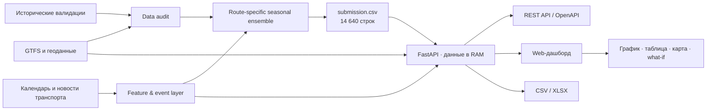
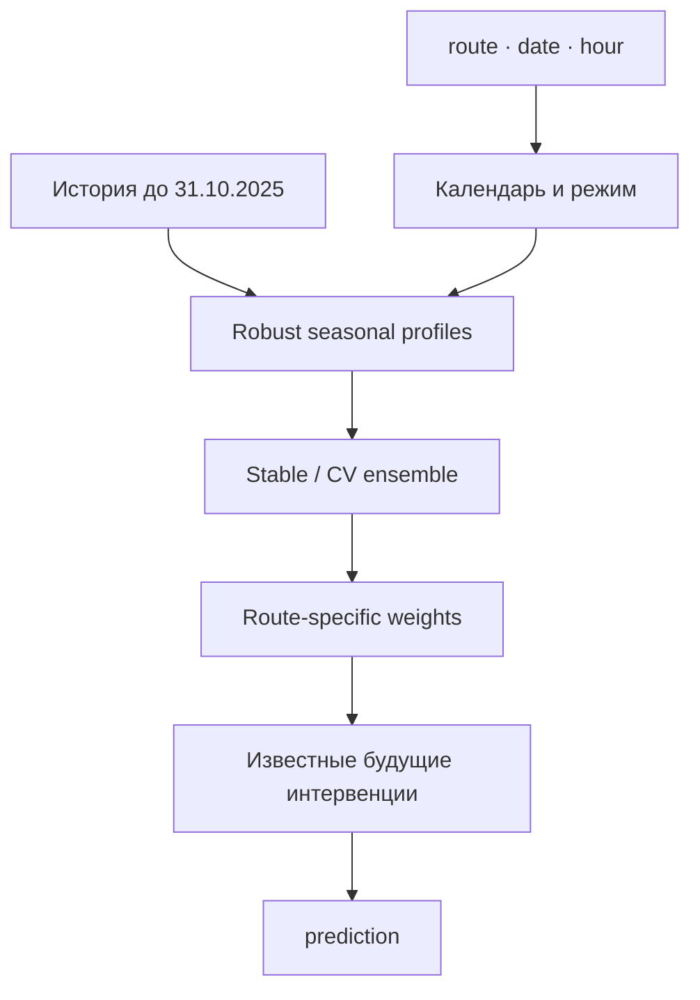

<div align="center">

# DLD · ИИ-прогноз загрузки трамвайных маршрутов

**Воспроизводимый прогноз пассажиропотока и сервис поддержки диспетчерских решений для Московского транспорта**

[](https://www.python.org/)
[](https://fastapi.tiangolo.com/)
[](https://www.docker.com/)
[](ml/README_ML.md)
[](docs/performance/docs/performance_and_features.md)

[Задача](https://mt-hackathon.ru/) · [ML и воспроизведение](ml/README_ML.md) · [Model Card](ml/MODEL_CARD.md) · [Внешние источники](docs/external_sources_for_final_solution/README.md) · [Нагрузочный тест](docs/performance/docs/performance_and_features.md)

</div>

## О проекте

Решение прогнозирует **число успешных валидаций по маршруту, дате и часу** и превращает прогноз в рабочий инструмент диспетчера: дашборд показывает динамику нагрузки, карту остановок, уже учтённые транспортные события и позволяет выгрузить данные.

Проект закрывает полный цикл:

```text
данные → аудит → временная валидация → ML-прогноз → API → дашборд → экспорт
```

| Параметр | Значение |
|---|---|
| Объект прогноза | Успешные валидации, не уникальные пассажиры и не заполняемость вагона |
| Маршруты | `1, 5, 7, 11, 12, 17, 25, 26, 28, 50` |
| Гранулярность | `route × date × hour` |
| Горизонт | 01.11.2025–31.12.2025 |
| Объём результата | 14 640 прогнозных точек |
| Финальная модель | Route-specific regime-aware robust seasonal ensemble, v3 |
| Leaderboard | **0.89577** для выбранного воспроизводимого submission |
| Производительность API | **646 RPS**, `p95 = 97 мс`, 0 ошибок в смешанном тесте |

Задача сформулирована как переход от реактивного управления транспортом к проактивному: заранее оценивать нагрузку и использовать прогноз при распределении подвижного состава. Официальное описание — на [сайте Хакатона Московского транспорта](https://mt-hackathon.ru/).

## Что реализовано

| Компонент | Возможности |
|---|---|
| ML | Почасовой прогноз для 10 маршрутов, календарные режимы, route-specific параметры, известные изменения сети |
| Data audit | Проверка схем, диапазонов, дубликатов, пропусков, временных границ и leakage-рисков до моделирования |
| Валидация | Последовательные out-of-time фолды без использования будущих значений target |
| Backend | FastAPI, фильтры по маршруту/дате/часу, события, геоданные, CSV/XLSX, OpenAPI, health-check |
| Дашборд | День/месяц/весь период, графики, таблица, агрегаты, карта и сценарий «что если» |
| Прозрачность | Model Card, журнал экспериментов, реестр источников, контрольная сумма submission |
| Deployment | Один Docker-контейнер: API и статический дашборд без отдельного frontend-сервера |

## Архитектура



Обучение отделено от online-serving: backend не переобучает модель на HTTP-запросе, а загружает проверенный прогноз и справочники **один раз при старте**. Это делает ответы быстрыми и детерминированными.

## ML-решение

### Почему выбран устойчивый сезонный ансамбль

Горизонт составляет 61 день, а история ограничена одним годом и содержит смены режимов маршрутной сети. В таких условиях сложность модели сама по себе не гарантирует перенос на будущее. Поэтому финальная версия сочетает:

- ключ `route × weekday × hour`;
- отдельные конфигурации для каждого маршрута;
- mean, median, trimmed mean и exponentially weighted mean;
- режимы `regular`, `summer`, `winter_break`;
- воскресный профиль для государственных праздников;
- route-specific смесь стабильной и адаптивной конфигураций;
- коррекцию почасовых долей для маршрутов 7 и 25;
- отдельный слой известных календарных и сетевых изменений.



### Известные будущие изменения

Временной ряд не способен самостоятельно узнать о событиях, которых не было в обучающей истории. Поэтому в прогноз явно и прозрачно внесены:

- рабочая суббота 1 ноября;
- запуск T1 12 ноября и сценарный эффект на маршрут 7;
- восстановление выходных трасс маршрутов 7 и 50;
- поздние ограничения маршрутов 7 и 50;
- cold start маршрута 5 с 16 декабря по supplied GTFS.

Все источники и модельные допущения разделены по статусам `used`, `confirmation_only`, `tested_not_selected`: [полный реестр](docs/external_sources_for_final_solution/README.md).

### Временная валидация

Используется rolling-origin/out-of-time проверка: любой fold обучается только на прошлом относительно проверяемого периода. Такой протокол соответствует рекомендациям по [time-series cross-validation](https://otexts.com/fpp3/tscv.html) и снижает риск завышенной оценки из-за временной утечки.

| Holdout | Score финальной базы |
|---|---:|
| May–Jun | 0.86049 |
| Jul–Aug | 0.81968 |
| Sep–Oct | 0.87722 |
| October diagnostic | **0.91169** |

Выбранный submission получил **0.89577** на leaderboard. Отдельный T1-probe достиг 0.89601 и подтвердил значимость сетевого изменения, однако финальным артефактом команды оставлен воспроизводимый сбалансированный v3 с `T1 factor = 0.90`.

### Что проверено и не вошло

| Подход | Результат |
|---|---|
| CatBoost / LightGBM по лагам | Не превзошли устойчивый seasonal ensemble на длинном горизонте |
| Recursive forecasting | Накапливал ошибку по мере удаления от origin |
| Daily residual CatBoost | Выигрыш оказался нестабильным между режимами |
| Погода ERA5 / Open-Meteo | Не дала устойчивого прироста temporal CV |
| Дорожный трафик и точечные сбои | Не подтвердили улучшение целевого route-hour прогноза |
| `выпуск × валидации на вагон` | Ограничен отсутствием будущего фактического выпуска |
| Direct multi-horizon | Локальный плюс найден только для маршрута 12, общий leaderboard не улучшен |

Полный журнал: [`ml/reports/experiments.csv`](ml/reports/experiments.csv) и [`ml/reports/scoremax_report.md`](ml/reports/scoremax_report.md).

## Первичная обработка данных

В [`data_preparation/`](data_preparation/README.md) вынесен воспроизводимый аудит исходных labels и GTFS-справочника: проверка схем и ключей, восстановление почасовой сетки, сравнение политик пропусков, проверка аномального дня маршрута 50 и подготовка географии. Скрипт сохраняет исходные значения и признаки отсутствующих наблюдений.

```bash
pip install -r data_preparation/requirements.txt
python data_preparation/prepare.py --dataset /path/to/dataset
```

Результаты сохраняются в `data_preparation/output/`. Это отдельный исследовательский этап: финальный ML по-прежнему читает исходные labels через `ml/src/load_data.py` и использует политику заполнения пропусков нулями. Подробные допущения и состав файлов — в [инструкции обработки](data_preparation/README.md).

## Данные и воспроизводимость

Исходный архив задания: [dataset.zip](https://disk.yandex.ru/d/DiFwlfMOauxjBg).

Для переобучения разместите данные так:

```text
ml/work/dataset/
├── labels/
│   ├── labels_day_train.csv
│   └── labels_day_test.csv
└── test_submission.csv
```

```bash
cd ml
python -m venv .venv
source .venv/bin/activate          # Windows: .venv\Scripts\activate
pip install -r requirements.txt

python src/train.py
python src/predict.py --t1-factor 0.90 --output outputs/submission_reproduced.csv
python scripts/check_submission.py outputs/submission_reproduced.csv
```

Контрольные характеристики финального файла:

| Проверка | Ожидаемое значение |
|---|---:|
| Строк | 14 640 |
| Сумма `prediction` | 12 550 152 |
| SHA-256 | `91db17acbbc18bb8ac845a2c90ddd946a1d6fff74cf4123a51ac6b31f45cc8f8` |
| Seed | `20250926` |

Модель детерминирована. Артефакт конфигурации находится в [`ml/models/seasonal_route_model.json`](ml/models/seasonal_route_model.json), описание — в [`ml/MODEL_CARD.md`](ml/MODEL_CARD.md).

## Дашборд и дополнительные возможности

- фильтрация по маршруту, дате, диапазону и часу;
- горизонты «день», «месяц» и весь доступный период;
- интерактивный график, таблица и сводные показатели;
- карта остановок и двух направлений для маршрутов с доступной географией;
- блок «что уже учтено моделью» со ссылками на первоисточники;
- явно отделённый сценарий «что если»: мероприятие `+10%/+35%`, ограничение `−15%`;
- выгрузка отфильтрованных данных в CSV и XLSX;
- Swagger UI `/docs`, ReDoc `/redoc`, health-check `/health`;
- единый контейнер без отдельной сборки React/Node.

> Сценарий «что если» — аналитическая демонстрация поверх базового прогноза, а не скрытое переобучение модели. Остановки используются для навигации и карты; текущий ML-target относится ко всему маршруту.

## Производительность

Исторический HTTP-тест оптимизированной версии из `docs/performance/` выполнен на MacBook Air M2, 8 CPU / 8 GB RAM, один Uvicorn worker.

| Сценарий | Нагрузка | RPS | p95 | Ошибки |
|---|---:|---:|---:|---:|
| Health-check | 5 000 запросов, concurrency 100 | 3 001.9 | 49.2 мс | 0 |
| Смешанный API | 4 000 запросов, concurrency 50 | **646.5** | **97.3 мс** | 0 |
| Полный прогноз, 14 640 строк | 100 запросов, concurrency 5 | 64.8 | 93.1 мс | 0 |
| CSV за месяц | 500 запросов, concurrency 20 | 369.6 | 63.2 мс | 0 |
| XLSX за месяц | 50 запросов, concurrency 3 | 28.6 | 119.6 мс | 0 |

Оптимизация выдачи прогноза перенесена в основной backend. Эти показатели относятся к исходному измерению, а не гарантируют ту же скорость на другом оборудовании.

Итого в исходном тесте: **9 650 запросов, 0 ошибок**, максимальный RSS — 172.3 MB. Методика и сырые результаты: [`docs/performance/docs/performance_and_features.md`](docs/performance/docs/performance_and_features.md).

## Быстрый запуск

### Docker — рекомендуемый способ

```bash
git clone https://github.com/fedorova-av/mt-hack-tram-flow-forecast.git
cd mt-hack-tram-flow-forecast
docker compose up --build
```

После запуска:

- дашборд — http://localhost:8000/
- Swagger — http://localhost:8000/docs
- ReDoc — http://localhost:8000/redoc
- health-check — http://localhost:8000/health

Остановка:

```bash
docker compose down
```

### Локальный запуск backend

```bash
cd backend
python -m venv .venv
source .venv/bin/activate          # Windows: .venv\Scripts\activate
pip install -r requirements.txt
uvicorn app.main:app --host 127.0.0.1 --port 8000
```

## Проверка после установки

Из корня репозитория:

```bash
pip install -r requirements-test.txt
python -m pytest tests -q
node tests/test_dashboard.cjs
python ml/scripts/check_submission.py ml/outputs/submission.csv
```

Node.js нужен только для проверки JavaScript, сам сервис запускается без него.
Проверка работающего сервиса: `python docs/performance/tests/smoke_test.py --base-url http://127.0.0.1:8000`.
Документы проекта доступны по `/project-docs/`, Swagger — по `/docs`.
[Отчёт о проверке поставки](docs/verification.md) описывает выполненные проверки и ограничения среды.

## API

| Метод | Endpoint | Назначение |
|---|---|---|
| GET | `/` | Дашборд |
| GET | `/health` | Проверка готовности |
| GET | `/forecast` | Фильтры `route`, `date_from`, `date_to`, `hour` |
| GET | `/forecast/routes` | Маршруты, суммы и доступность карты |
| GET | `/events/applied` | Учтённые моделью события для маршрута и периода |
| GET | `/geo/routes-with-map` | Маршруты с географией |
| GET | `/geo/route/{route}` | Остановки двух направлений |
| GET | `/export/csv` | Выгрузка CSV |
| GET | `/export/xlsx` | Выгрузка XLSX |

Пример:

```bash
curl "http://localhost:8000/forecast?route=7&date_from=2025-11-01&date_to=2025-11-07"
```

## Структура репозитория

```text
.
├── backend/                  # FastAPI, dashboard, forecast and geo data
│   ├── app/
│   ├── data/
│   ├── README.md
│   └── requirements.txt
├── data_preparation/         # аудит labels, пропусков и подготовка географии
│   ├── prepare.py
│   ├── README.md
│   └── requirements.txt
├── tests/                    # проверки API и границ месяца в дашборде
├── ml/                       # training, validation, inference and model artifact
│   ├── src/
│   ├── models/
│   ├── outputs/
│   ├── predictions/
│   └── reports/
├── docs/
│   ├── external_sources_for_final_solution/
│   └── performance/
├── Dockerfile
└── docker-compose.yml
```

## Область применимости

- Модель прогнозирует **успешные оплаты**, а не физическое число людей в вагоне.
- Прогноз доступен только для 10 заданных маршрутов и горизонта ноябрь–декабрь 2025.
- Карта покрывает маршруты 1, 5, 7, 11 и 12 — география остальных маршрутов отсутствует в исходном справочнике.
- Коэффициенты будущих сетевых изменений являются явными сценарными допущениями и документированы.
- Погода, общий трафик, школьные каникулы и фактический target прогнозного периода не входят в финальную модель.
- Для production следует ограничить CORS, добавить аутентификацию при необходимости, TLS/reverse proxy, мониторинг и версионирование прогнозов.

## Развитие решения

1. Подключить GTFS-Realtime, GPS, фактический выпуск и отмены рейсов.
2. Перейти к rolling inference и мониторингу drift/качества после появления target.
3. Расширить географию и построить stop-level/graph forecast при наличии полного графа сети.
4. Добавить интервальные прогнозы и алерты о превышении пропускной способности.
5. Версионировать модель и данные через registry, добавить CI для smoke/load tests.

## Методологические ориентиры

| Источник | Связь с проектом |
|---|---|
| [Forecasting: Principles and Practice — time-series cross-validation](https://otexts.com/fpp3/tscv.html) | Rolling-origin валидация без будущих данных |
| [TiDE — Long-horizon Forecasting](https://research.google/pubs/long-horizon-forecasting-with-tide-time-series-dense-encoder/) | Direct multi-horizon модели и известные будущие ковариаты |
| [Temporal Fusion Transformer](https://research.google/pubs/temporal-fusion-transformers-for-interpretable-multi-horizon-time-series-forecasting/) | Интерпретируемая работа со static/known-future/exogenous признаками |
| [N-HiTS](https://arxiv.org/abs/2201.12886) | Иерархическая декомпозиция временных масштабов для длинного горизонта |
| [PatchTST, ICLR 2023](https://openreview.net/forum?id=Jbdc0vTOcol) | Patch-based представление длинных временных рядов |
| [DCRNN, ICLR 2018](https://research.google/pubs/diffusion-convolutional-recurrent-neural-network-data-driven-traffic-forecasting/) | Перспектива graph forecasting при наличии полного графа остановок |
| [GTFS Schedule Reference](https://gtfs.org/documentation/schedule/reference/) | Стандарт маршрутов, рейсов, остановок и календарных исключений |

Финальный выбор модели сделан не по модности архитектуры, а по leakage-safe проверке на доступных данных: современные модели использованы как ориентир и направление развития, а в production-артефакт вошла конфигурация с лучшим балансом качества, устойчивости, объяснимости и скорости.

## Документация

- [Первичная обработка данных](data_preparation/README.md)
- [Backend и дашборд](backend/README.md)
- [ML: запуск обучения и инференса](ml/README_ML.md)
- [Model Card](ml/MODEL_CARD.md)
- [Эксперименты и выбор v3](ml/reports/scoremax_report.md)
- [Внешние данные и источники](docs/external_sources_for_final_solution/README.md)
- [Производительность и дополнительные возможности](docs/performance/docs/performance_and_features.md)

---

<div align="center">

**DLD · Хакатон Московского транспорта · 2026**

</div>
