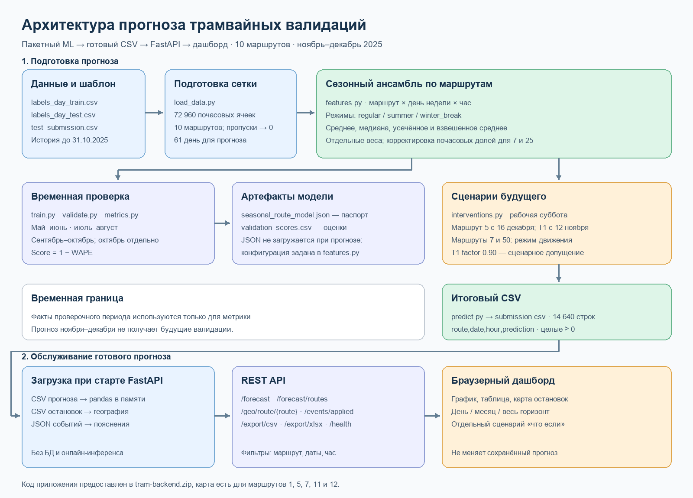

# Архитектура решения

[Открыть векторную схему](architecture.svg)

## Что реализовано

Этот документ описывает ML-часть и переданное коллегой приложение из `tram-backend.zip`. Выбранная модель — **route-specific regime-aware robust seasonal ensemble**: ансамбль устойчивых сезонных профилей с отдельными настройками по маршрутам. Её вход — исторические почасовые агрегаты и заданная сетка будущих часов. Выход — файл `route;date;hour;prediction`, который можно проверить и передать в систему оценки. Обучение и прогноз выполняются командами из [ML-инструкции](../ml/README_ML.md). Прогноз рассчитывается пакетно: HTTP-сервис читает готовый CSV, а не запускает модель при запросе.

| Компонент | Назначение | Результат |
|---|---|---|
| [`ml/src/load_data.py`](../ml/src/load_data.py) | Читает CSV с разделителем `;`, ограничивает историю 31 октября 2025 года и восстанавливает отсутствующие часы нулями. | Полная историческая сетка 10 маршрутов × 304 дня × 24 часа; сетка прогноза на 61 день. |
| [`ml/src/features.py`](../ml/src/features.py) | Добавляет календарный режим и рассчитывает робастные профили `маршрут × день недели × час`. Смешивает стабильную и консервативную конфигурации по маршрутам; для 7 и 25 корректирует почасовые доли. | Базовый прогноз без будущих сетевых событий. |
| [`ml/src/validate.py`](../ml/src/validate.py), [`ml/src/metrics.py`](../ml/src/metrics.py) | Проверяют модель с фиксированной датой отсечения: май–июнь, июль–август, сентябрь–октябрь; октябрь — отдельная диагностика. Метрика — `1 − WAPE`. | Оценки временных проверок. |
| [`ml/src/train.py`](../ml/src/train.py) | Запускает проверки и записывает выбранную конфигурацию и результаты. | [`seasonal_route_model.json`](../ml/models/seasonal_route_model.json), `ml/predictions/validation_scores.csv`. |
| [`ml/src/predict.py`](../ml/src/predict.py), [`ml/src/interventions.py`](../ml/src/interventions.py) | Считают базовый прогноз, затем применяют сценарии календаря и сети: рабочая суббота, новый маршрут 5, T1, изменения маршрутов 7 и 50. Ограничивают значения снизу нулём и округляют. | [`ml/outputs/submission.csv`](../ml/outputs/submission.csv), 14 640 строк. |
| [`ml/scripts/check_submission.py`](../ml/scripts/check_submission.py) | Проверяет формат и ключи сохранённого прогноза. | Проверенный файл для отправки. |

## Поток данных и воспроизводимость

1. Данные соревнования размещаются локально по структуре из [`ml/data/README.md`](../ml/data/README.md). Большой исходный архив в Git не хранится.
2. История до даты начала каждого проверочного периода используется для построения профилей. Факты проверочного периода нужны только для метрики; при финальном прогнозе после 31 октября они недоступны.
3. `train.py` записывает JSON с параметрами и оценками. При инференсе `predict.py` **не загружает** этот JSON: он использует те же конфигурации, заданные в `features.py`. Поэтому для воспроизведения нужны код и исторические CSV, а JSON служит паспортом выбранной версии.
4. `predict.py` применяет события **один раз**. Готовый `submission.csv` уже содержит эти поправки; повторять их при показе прогноза нельзя. Даты и происхождение внешних сведений описаны в [реестре источников](external_sources_for_final_solution/external_sources.md).

## Приложение и контракт между частями

Код приложения передан в `tram-backend.zip` (папка `tram-backend/` внутри архива). В текущем репозитории `backend/` пока содержит только README и зависимости; отдельная доработанная копия сервиса и замеры размещены в [`docs/performance/`](performance/README.md). Поэтому описанная ниже реализация API подтверждена исходниками архива, а готовность единой сборки из корня репозитория отдельно не заявляется.

| Слой | Реализация в архиве | Роль |
|---|---|---|
| Точка входа | `app/main.py` | FastAPI, CORS, статический дашборд; при старте однократно загружает три набора данных. |
| Прогноз | `app/data_loader.py`, `app/routers/forecast.py` | Читает `data/test_submission.csv` с разделителем `;` в pandas; фильтрует по маршруту, диапазону дат и часу; отдаёт `count` и `items`, а также сводки маршрутов. |
| География | `app/geo_loader.py`, `app/routers/geo.py` | Читает `route_stops_map.csv`, отбрасывает неподходящие записи и возвращает остановки по `trip_id`, `direction_id`, `stop_sequence`. |
| События | `app/events_loader.py`, `app/routers/events.py` | Читает `calendar_and_events.json` и объясняет уже учтённые календарные и сетевые события. **Не меняет** `prediction`. |
| Выгрузка | `app/routers/export.py` | Формирует отфильтрованные CSV и XLSX в памяти, без временных файлов. |
| Интерфейс | `app/static/index.html` | Запрашивает API, показывает график, таблицу и карту. Сценарий «что если» умножает значения только в браузере и отделён от базового прогноза. |

Контракт на границе ML и API — одна строка на `route × date × hour` с полями `route;date;hour;prediction`. Архивный `data/test_submission.csv` содержит те же **14 640 строк данных**, что и [`ml/outputs/submission.csv`](../ml/outputs/submission.csv); различается завершающий перевод строки, поэтому SHA-256 файлов не совпадает. В архивном `main.py` путь указывает на `data/test_submission.csv`. В доработанной копии [`docs/performance/app/main.py`](performance/app/main.py) путь изменён на `data/submission.csv`; это отдельная копия, не код из `backend/` в корне.

Запрос браузера идёт так: `/forecast/routes` заполняет список маршрутов; `/forecast` возвращает выбранный срез; `/events/applied` добавляет пояснения; `/geo/route/{route}` предоставляет остановки; `/export/csv` и `/export/xlsx` выгружают тот же отфильтрованный срез. Представления «день», «месяц» и «весь период» используют один API с разными границами дат. Остановочная география есть только для маршрутов **1, 5, 7, 11, 12**. Линии на карте соединяют остановки по порядку и не являются точной геометрией путей; почасовая интенсивность относится ко **всему маршруту**, а не к каждой остановке.

## Развёртывание и проверка

В архиве сервис запускается из его корня командой `uvicorn app.main:app --port 8000`; требуются файлы в `data/`. После запуска доступны `/`, `/health` и OpenAPI `/docs`. Для демо CORS разрешает все источники. База данных и очередь не используются: прогноз, география и реестр событий хранятся в памяти процесса. Новая версия CSV требует перезапуска сервиса.

[Отдельная доработанная копия](performance/README.md) проходила локальные HTTP-тесты: 9 650 запросов без ошибок, смешанный сценарий — 646 RPS и p95 97 мс на указанной в отчёте машине. Эти цифры относятся **только к протестированной копии** и не доказывают производительность исходного архива или будущего развёртывания. Методика и ограничения — в [отчёте](performance/docs/performance_and_features.md).
